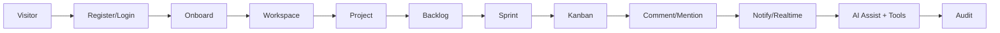

# USER_WORKFLOWS + Diagrams

Visitor: landing → explore → register/login.
New user: register → verify → onboard → create/join workspace → dashboard.
Owner: workspace → configure → invite → project → configure.
PM: project → backlog → sprint → assign → monitor → analytics.
Dev: assigned task → inspect → work → comment → upload → status → complete.
Reviewer: view → inspect → comment → approve/request changes.
AI user: open assistant → request → context retrieval → cited response → propose tool → confirm (destructive) → execute → audit.

