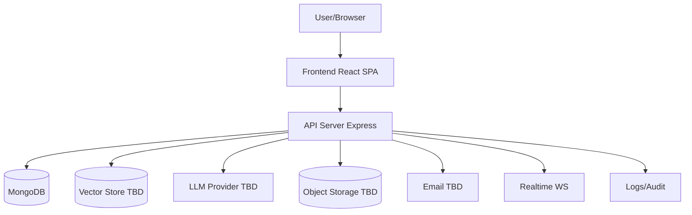

# SYSTEM_DESIGN (Context / Container / Component)

`DECISION` modular monolith. No microservices (D001).

## Context

## Container

Frontend SPA | API (auth, task, project, AI, realtime modules) | Workers (embeddings, notifications — in-process first) | MongoDB | Vector store | Object storage | Email.

## Components (summary)

Frontend: router, query client, UI kit, feature modules (auth/workspace/project/board/AI), WS client.
Backend: routes→middleware→controllers→services→repos; AI subsystem (provider adapter, prompts, RAG, tools, agent loop); realtime gateway.
See FRONTEND/BACKEND/AI/WEBSOCKET docs for detail. All TBD items `UNRESOLVED` pending ADR-005–010.
